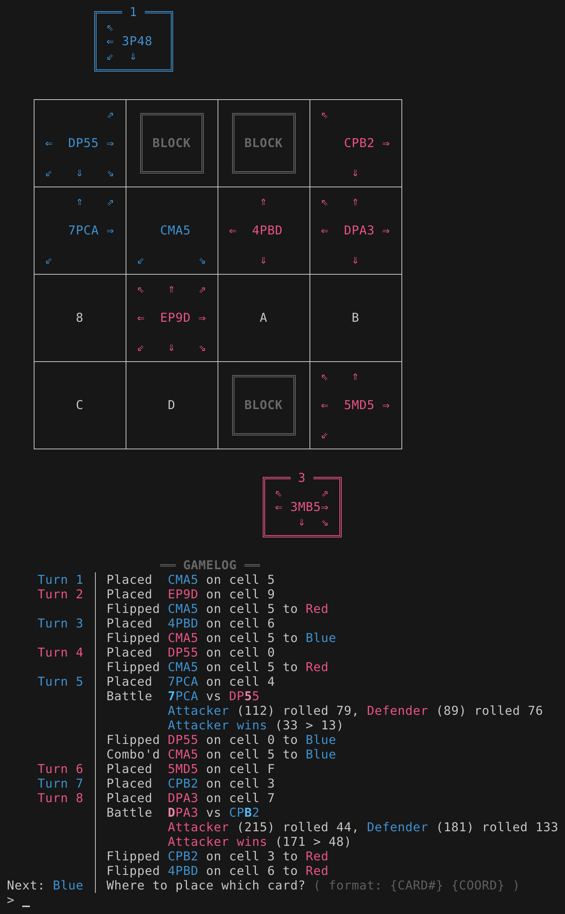

# Tetra Master

Tetra Master is a card-based minigame in Final Fantasy 9.

This is a (mostly) faithful implementation of that game modified to be (mostly)
perfect information game.

# Rules

The board is a 4x4 grid with a random number of up to 6 of cells blocked. Cards
cannot be placed on blocked cells.

Both players are given a random hand of 5 cards.

Each card has 4 stats represented as 4 characters (eg: `4P78`), as well as up to
8 arrows pointing away from it.

-   The players take turns placing cards on the board.
-   If a placed card points to an opponent's card that doesn't point back,
    that card will "flip" (meaning the card changes sides and now belongs to the
    other player, the actual orientation of the card doesn't change).
-   If the opponent's card does point back, the two cards will battle and the
    losing card will be flipped.
-   When a card loses a battle, all the cards pointed to by the losing card
    will also flip. This is called a combo.

The goal is to have the most cards once the last card has been played.

## Battles

When a card is placed on the board and it points to another card those two cards
will battle if:

1. the other card belongs to the opponent
2. both cards point to each other

ie. The card that was placed on the board attacks the other card which defends.

Battles use the each cards' stats along with random rolls to determine a winner.

A card's stats from left to right are

1. the attack value
2. the card type
3. the physical defense value
4. the magical defense value

The values are hexidecimal numbers that represent the real value.

Let V be the hexidecimal number of the card. The real value is between `(16 * V)` and `(16 * V + 15)`

eg; if the attack value of a card says B (11 in hex), the real value is between
176 and 191.

First one value on each card must be chosen, this is determined by the the
attacking card's type.

| Attacking Card's Type | Attacking Card's Stat         | Defending Card's Stat                                            |
| --------------------- | ----------------------------- | ---------------------------------------------------------------- |
| `P` Physical          | the attack value              | the physical defense value                                       |
| `M` Magical           | the attack value              | the magical defense value                                        |
| `X` eXploit           | the attack value              | the lower number between the physical and magical defense values |
| `A` Assault           | the highest value on the card | the lowest value on the card                                     |

Once both numbers are chosen, 2 random numbers are rolled:

-   attack roll = random number between 0 and the chosen attack stat

-   defense roll = random number between 0 and the chosen defense stat

These rolls are subtracted from the corresponding chosen stat and the higher
number wins.

eg:

-   Attacking card: `8X35`
-   Defending card: `3X97`
-   As the attacking card has a type of `X`
    -   Attack stat is `8` (the attack value)
    -   Defense stat is `7` (the lower number between the physical and magical defense values)
-   Let's say the real values behind those stats are
    -   Attack real value is `138`
    -   Defense real value is `118`
-   The 2 random rolls are made
    -   Attack roll is `120`
    -   Defense roll is `74`
-   Those rolls are subtracted from the real values
    -   Final attack = `18` (`138 - 120)`
    -   Final defense = `44` (`118 - 74`)
-   As `44 > 18`, the defender wins

In the case of a tie, the defender is considered the winner by default.

# Running

The program is written in Rust and the recommended way to run it is to install
Rust and use `cargo run --release`.
